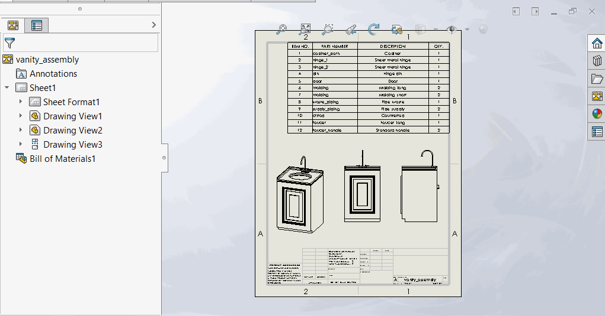

# xlBOM with thumbnails
SOLIDWORKS add-in that exports Bill of Materials to Excel with thumbnails.

# Preview

# Download
Check [release](https://github.com/jliliamen/ThumbnailedBOM/releases) page. 

# Additional notes
SOLIDWORKS 2020 provides a similar feature to what this addin does which can be found [here](http://help.solidworks.com/2020/english/solidworks/sldworks/t_saving_boms.htm) . Unfortunately, this feature is not available in 2020 SP0.
